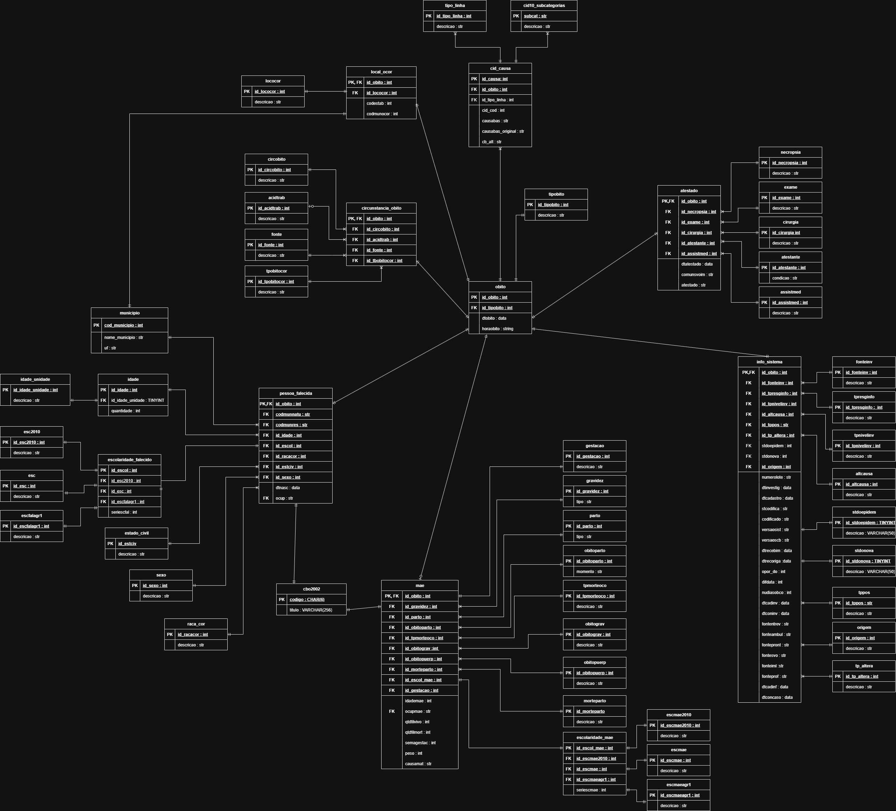
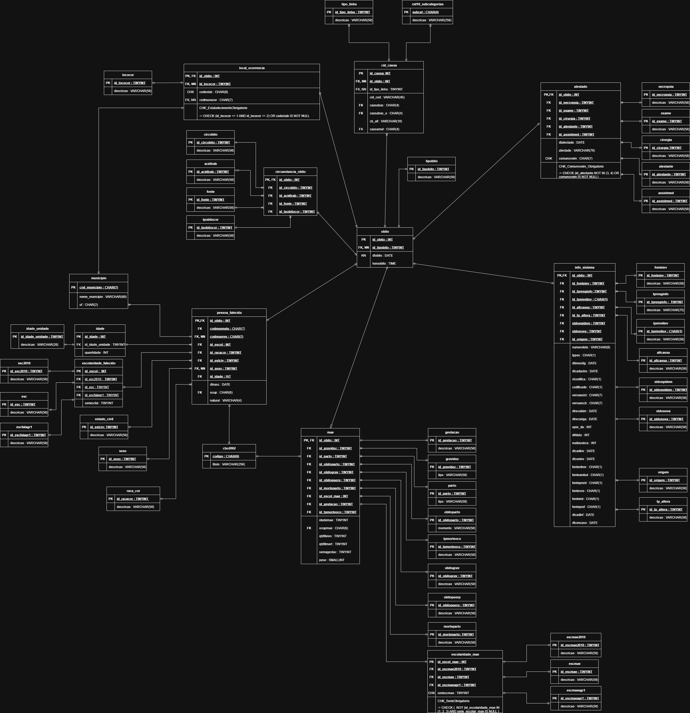

# 🗄️ Projeto - Gerenciamento de Banco de Dados  
### Grupo: **DELETE**  

---

## 📌 Descrição do Projeto  

Este projeto, desenvolvido na disciplina **Gerenciamento de Banco de Dados**, tem como objetivo aplicar um ciclo completo de engenharia e análise de dados utilizando exclusivamente **T-SQL**.  

O dataset escolhido trata de **mortalidade no Brasil**, contendo informações como causas de óbito, idade, sexo, escolaridade, estado civil, local de ocorrência e dados materno-infantis.  

O trabalho envolve:  
- **Modelagem de dados** (DER completo com mais de 20 tabelas e tabela fato com >200k registros).  
- **Processo de ETL em T-SQL** para limpeza, transformação e carga dos dados.  
- **Análises de negócio** por meio de Stored Procedures, Views e Functions, respondendo perguntas sobre perfis demográficos, geográficos e causas de mortalidade.  
- **Segurança e governança de dados** via criação de roles e permissões distintas.  
- **Documentação completa** (dicionário de dados, manual de uso e versionamento no GitHub).  

O projeto busca não apenas exercitar habilidades técnicas em **banco de dados e SQL**, mas também **gerar insights relevantes** para a compreensão de padrões e tendências da saúde pública no Brasil.  

---

## 🔎 Plano de Análise  

O projeto foi organizado em quatro grandes **eixos de investigação**, cada um com perguntas de negócio específicas a serem respondidas com T-SQL:  

### **Eixo 1: Perfil Demográfico e Social dos Óbitos**  
- **Pergunta 1.1:** Qual é a distribuição de óbitos por faixa etária, sexo e raça/cor? Existem combinações (ex: mulheres pardas entre 20-29 anos) com volume de mortalidade desproporcional?  
- **Pergunta 1.2:** Qual a correlação entre o nível de escolaridade do falecido e a idade ao morrer? Pessoas com maior escolaridade tendem a ter uma expectativa de vida maior?  
- **Pergunta 1.3:** Qual é o perfil de mortalidade por estado civil? Existe uma diferença significativa na causa básica de morte entre solteiros, casados e viúvos?  
- **Pergunta 1.4:** Quais são as ocupações (CBO) mais frequentes entre os óbitos por acidentes de trabalho?  

### **Eixo 2: Análise Geográfica e de Local de Ocorrência**  
- **Pergunta 2.1:** Qual o ranking de municípios com os maiores números de mortalidade por causas violentas (homicídios, suicídios, acidentes)?  
- **Pergunta 2.2:** Qual a porcentagem de óbitos que ocorrem fora de um estabelecimento de saúde (domicílio, via pública) por município de residência? Isso pode indicar um acesso precário ao sistema de saúde?  
- **Pergunta 2.3:** Existe uma diferença entre o município de residência e o município de ocorrência do óbito? Análises sobre este fluxo podem indicar a busca por atendimento médico em outras cidades.  

### **Eixo 3: Análise das Causas de Morte**  
- **Pergunta 3.1:** Quais são as 10 principais causas básicas de morte (CAUSABAS) para homens e mulheres em diferentes faixas etárias?  
- **Pergunta 3.2:** Como a falta de assistência médica durante a doença se relaciona com a causa do óbito? Certas doenças apresentam maior percentual de óbitos sem assistência?  
- **Pergunta 3.3:** Óbitos por causas violentas estão mais associados a qual fonte de informação (ocorrência policial, hospital)?  

### **Eixo 4: Análise de Mortalidade Materno-Infantil**  
- **Pergunta 4.1:** Qual é a distribuição da idade materna entre os casos de óbitos no primeiro ano de vida? 
- **Pergunta 4.2:** Onde esses óbitos ocorrem com maior frequência (hospital, domicílio, via pública)?  
- **Pergunta 4.3:** Qual é a distribuição do peso ao nascer para óbitos não fetais que ocorrem no primeiro ano de vida?  
- **Pergunta 4.4:** Como a idade gestacional se relaciona com a ocorrência de óbito infantil?  

--- 

## 📅 Planejamento Semanal  

O projeto foi organizado em 13 semanas, seguindo um cronograma que garante a evolução do trabalho desde a definição do tema até a apresentação final:  

| Semana | Atividade |
|--------|-----------|
| **Semana 1** | Definição do tema, encontrar e analisar o conjunto de dados bruto. Criação do repositório/Kanban. |
| **Semana 2** | Com base na análise, criar o Modelo Lógico e o documento do Plano de Análise, definindo as perguntas de negócio. |
| **Semana 3** | Finalizar o Modelo Físico com tipos de dados e restrições do SQL Server. |
| **Semana 4** | Criar todos os scripts DDL e executar a estrutura do banco. |
| **Semana 5** | Codificar as Stored Procedures de ETL. Testar a extração e transformação com uma amostra dos dados. |
| **Semana 6** | Executar o ETL completo. Criar consultas DQL para validar a carga e explorar os dados. |
| **Semana 7** | Criar visualizações (Views) para simplificar a análise e índices para otimizar consultas futuras. |
| **Semana 8** | Implementar os Procedimentos Armazenados que respondem às perguntas do Plano de Análise, gerando métricas e relatórios. |
| **Semana 9** | Criar triggers para auditoria/validação e controle de transações. |
| **Semana 10** | Implementar a estratégia de segurança com logins, usuários e perfis. |
| **Semana 11** | Finalizar a documentação. Iniciar a criação do dashboard de BI (opcional). |
| **Semana 12** | Preparar a apresentação final. |
| **Semana 13** | Defesa do projeto, demonstrando o processo de ETL e os insights gerados pelas análises. |

---

## 👥 Colaboradores 

| Colaborador | Cargo |
| :--- | :--- |
| [Artur Farias](https://github.com/Fariasartuur) | Engenheiro de Dados, Analista de Dados |
| [Bartolomeu Gomes](https://github.com/BartoNeto) | Engenheiro de Dados, Analista de Dados |
| [Pedro Oliveira](https://github.com/Pedro-R-Oliveira) | Engenheiro de Dados, Analista de Dados |
| [Victória Ester](https://github.com/Victoriaester741) | Engenheiro de Dados, Arquiteto de Dados |
| [Christian Mendonça](https://github.com/chrisgubany) | Analista de Dados, Arquiteto de Dados |
| [Octávio França](https://github.com/ofrancakoch) | Engenheiro de Dados, Analista de Dados, Arquiteto de Dados |

---

## 📁 Dataset 

### Dataset de Mortalidade  
- **Fonte:** [Sistema de Informação sobre Mortalidade – SIM](https://opendatasus.saude.gov.br/dataset/sim)  
- **Descrição:** O SIM é uma ferramenta para coletar dados de óbito no Brasil, visando a identificação de padrões e insights sobre a saúde pública. O conjunto de dados inclui informações detalhadas como:  
  - Idade, sexo, raça/cor  
  - Escolaridade e estado civil  
  - Causa básica de morte e acidentes de trabalho  
  - Local de ocorrência e município de residência  
  - Dados materno-infantis (óbitos fetais, idade da mãe, tipo de parto, peso ao nascer)  
- **Formato:** Arquivos CSV disponibilizados para download
- **Características dos Dados Brutos:** A análise inicial revelou que os dados são codificados e requerem um processo de ETL robusto:
  - **Dados Categóricos:** Muitos campos usam códigos numéricos (ex: 1 para "sim", 2 para "não").
  - **Necessidade de Transformação:** Campos de data e hora estão em formato de texto (ex: ddmmaaaa) e devem ser convertidos para tipos de dados DATE e TIME.
  - **Campos Compostos:** O campo IDADE é composto por dois subcampos: o primeiro indica a unidade da idade e o segundo, a quantidade.
- **Dicionário de Dados:** [Link para o Dicionário SIM](https://s3.sa-east-1.amazonaws.com/ckan.saude.gov.br/SIM/Dicionario_SIM_2025.pdf) 
- **Dataset Usado:** [Mortalidade Geral 2024](https://s3.sa-east-1.amazonaws.com/ckan.saude.gov.br/SIM/csv/DO24OPEN_csv.zip)

## 📈 Gestão e Acompanhamento

- **Kanban/Quadro de Gestão:** [Trello do Projeto](https://trello.com/b/K8ngjmX5)
- **Business Intelligence (BI):** (em desenvolvimento)

## 📄 Documentos

### Modelagem
- **Modelo Logico** (Clicar em cima para melhor visualização):
  - 
- **Modelo Fisico** (Clicar em cima para melhor visualização):
  - 
 
### Plano de Analise e Dicionario de Dados
- **[Plano de Análise](docs/arquivos/plano_de_analise.pdf):** Perguntas de negócio e métricas a serem extraídas.
- **[Dicionário de Dados](docs/arquivos/dicionario_mortalidade.xlsx):** Descrição completa dos campos do dataset, tipos de dados e relações entre tabelas.
  - [Arquivo MarkDown](dicionario_mortalidade.md) do dicionario.
  
### ⚙️ Scripts e Ordem de Execução

Para configurar o banco de dados e executar o ETL, siga a ordem abaixo:

**Passo 1: Criação do Banco de Dados e Carga dos Domínios**
- **[Arquivo](scripts/create_db.sql):** **`scripts/create_db.sql`**
- **Descrição:** Script único responsável pela criação do banco de dados `mortalidade`, de todas as tabelas, `chave`, `constraints`, `checks` e pela inserção dos dados em todas as tabelas de domínio.

**Passo 2: Execução do script de criação dos Triggers**
- **[Trigger de Auditoria](scripts/trigger_auditoria.sql):** **`scripts/trigger_auditoria.sql`**
- **[Trigger de Validação](scripts/trigger_validacao.sql):** **`scripts/trigger_validacao.sql`**
- **Descrição:** Este passo executa os scripts que criam dois gatilhos automáticos: um de auditoria, para registrar um histórico completo de todas as alterações feitas nos dados, e um de validação, para garantir a integridade das informações aplicando regras de negócio antes de serem salvas.

**Passo 3: Criação das Stored Procedures do ETL**
- **[Arquivo](scripts/sp_municipios.sql):** **`scripts/sp_municipios.sql`**
  - **Descrição:** Cria a Stored Procedure que realiza a etapa de **Extração (Extract)**, **Transformação (Transform)** e **Carga (Load)** dos dados dos [municipios](datasets/BR_Municipios_2024.csv).
- **[Arquivo](scripts/sp_cid10.sql):** **`scripts/sp_cid10.sql`**
  - **Descrição:** Cria a Stored Procedure que realiza a etapa de **Extração (Extract)**, **Transformação (Transform)** e **Carga (Load)** dos dados do [CID](datasets/CID-10-SUBCATEGORIAS.CSV).
- **[Arquivo](scripts/sp_cbo2002.sql):** **`scripts/sp_cbo2002.sql`**
  - **Descrição:** Cria a Stored Procedure que realiza a etapa de **Extração (Extract)**, **Transformação (Transform)** e **Carga (Load)** dos dados da [CBO](datasets/cbo2002-ocupacao.csv).
- **[Arquivo](scripts/sp_cnes.sql):** **`scripts/sp_cnes.sql`**
  - **Descrição:** Cria a Stored Procedure que realiza a etapa de **Extração (Extract)**, **Transformação (Transform)** e **Carga (Load)** dos dados da [CNES](https://opendatasus.saude.gov.br/dataset/cnes-cadastro-nacional-de-estabelecimentos-de-saude#).
- **[Arquivo](scripts/sp_obito.sql):** **`scripts/sp_obito.sql`**
  - **Descrição:** Cria a Stored Procedure que realiza a etapa de **Extração (Extract)**, **Transformação (Transform)** e **Carga (Load)** dos dados dos [obitos](https://s3.sa-east-1.amazonaws.com/ckan.saude.gov.br/SIM/csv/DO24OPEN_csv.zip).

**Passo 4: Execução do ETL Completo**
- **[Arquivo](scripts/execucao_etl.sql):** **`scripts/execucao_etl.sql`**
- **Descrição:** Este script orquestra todo o processo de carga, executando as Stored Procedures mestras na ordem correta. É o único script que precisa ser executado para popular o Data Warehouse após a configuração inicial.
- **Como Executar:**
1. Abra o arquivo. 
2. **Importante:** Altere as variáveis `@CaminhoArquivoMunicipios`, `@CaminhoArquivoCBO`, `@CaminhoArquivoCID`, `@CaminhoArquivoCNES` e `@CaminhoArquivoObitos` para que apontem para os locais corretos dos seus arquivos CSV.
3. Execute o script completo.

**Passo 5: Execução do script de criação de índices (Index)**
- **[Arquivo](scripts/create_indexes.sql):** **`scripts/create_indexes.sql`**
- **Descrição:** Esse script faz a criação dos indices no qual vão otimizar as buscas necessarias para a analise dos dados.

**Passo 6: Execução do script de criação das Exibições (Views)**
- **[Arquivo](scripts/views.sql):** **`scripts/views.sql`**
- **Descrição:** Esse script faz a criação das exibições (views) no qual vão responder as perguntas do [plano de analise](docs/arquivos/plano_de_analise.pdf) e de outros views usados futuramente.

**Passo 7: Criação e Execução das Análises**
- **[Arquivo](scripts/sp_analiticas.sql):** **`scripts/sp_analiticas.sql`**
- **[Arquivo](scripts/exec_proc_analiticas.sql):** **`exec_proc_analiticas.sql`**
- **Descrição:** Este passo cria e executa as 13 Stored Procedures analíticas, cada uma respondendo a uma pergunta do [plano de analise](docs/arquivos/plano_de_analise.pdf)

**Passo 8: Configuração de Segurança**
- **[Arquivo](scripts/seguranca_dcl.sql):** **`scripts/segurança_dcl.sql`**
- **Descrição:** Define os logins, usuários e as permissões de acesso ao banco de dados, conforme os requisitos do projeto.

### ⚙️ Scripts Extras

**Script para consulta das tabelas de domínio**
- **[Arquivo](scripts/consult_tbd.sql)** **`scripts/consult_tbd.sql`**
- **Descrição:** Este script executa um SELECT em todas as tabelas de domínio (lookup tables) para exibir os valores de referência (ID vs. Descrição).
  > Para tabelas grandes, é exibida uma amostra das primeiras 100 linhas

**Validação da carga do ETL**
- **[Arquivo](scripts/consultas_dql.sql)** **`scripts/consultas_dql.sql`**
- **Descrição:** Este script garante que o processo de ETL foi executado com sucesso, os dados foram carregados e a integridade básica está mantida.

**Execução das VIEWS**
- **[Arquivo](scripts/run_reports.sql)** **`scripts/run_reports.sql`**
- **Descrição:** Este script roda todas as views criadas usadas para a parte de analise do projeto.

### 📁 Datasets

**Dataset dos Obitos:**
- **[DO24OPEN](https://s3.sa-east-1.amazonaws.com/ckan.saude.gov.br/SIM/csv/DO24OPEN_csv.zip)**

**Dataset dos Municipios:**
- **[BR_Municipios_2024](datasets/BR_Municipios_2024.csv)**

**Dataset dos Codigos Internacional de Doencas:**
- **[CID-10-SUBCATEGORIA](datasets/CID-10-SUBCATEGORIAS.CSV)**

**Dataset dos Codigos da Classificação Brasileira de Ocupações:**
- **[cbo2002-ocupacao](datasets/cbo2002-ocupacao.csv)**

**Dataset dos Codigos do Cadastro Nacional de Estabelecimentos de Saúde:**
- **[cnes_estabelecimentos](https://opendatasus.saude.gov.br/dataset/cnes-cadastro-nacional-de-estabelecimentos-de-saude#)**

  
> Observação: Todos os documentos estão versionados e disponíveis no repositório do GitHub
