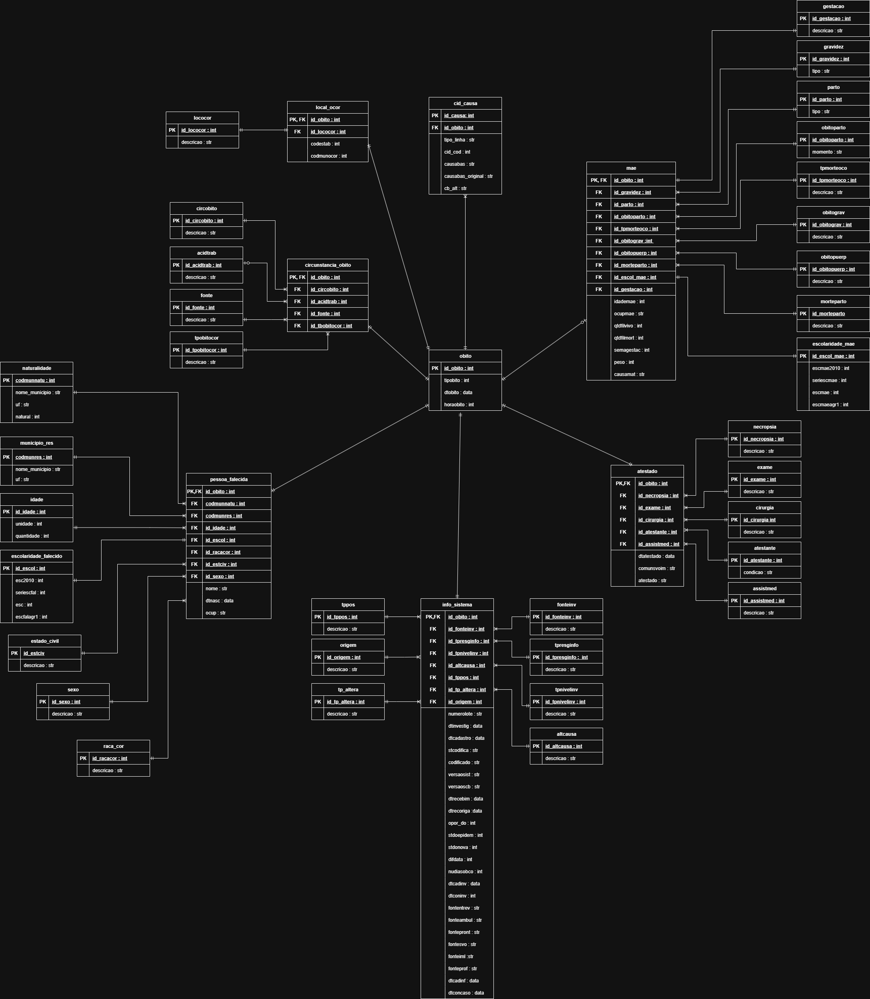

# 🗄️ Projeto - Gerenciamento de Banco de Dados  
### Grupo: **DELETE**  

---

## 📌 Descrição do Projeto  

Este projeto, desenvolvido na disciplina **Gerenciamento de Banco de Dados**, tem como objetivo aplicar um ciclo completo de engenharia e análise de dados utilizando exclusivamente **T-SQL**.  

O dataset escolhido trata de **mortalidade no Brasil**, contendo informações como causas de óbito, idade, sexo, escolaridade, estado civil, local de ocorrência e dados materno-infantis.  

O trabalho envolve:  
- **Modelagem de dados** (DER completo com mais de 20 tabelas e tabela fato com >200k registros).  
- **Processo de ETL em T-SQL** para limpeza, transformação e carga dos dados.  
- **Análises de negócio** por meio de Stored Procedures, Views e Functions, respondendo perguntas sobre perfis demográficos, geográficos e causas de mortalidade.  
- **Segurança e governança de dados** via criação de roles e permissões distintas.  
- **Documentação completa** (dicionário de dados, manual de uso e versionamento no GitHub).  

O projeto busca não apenas exercitar habilidades técnicas em **banco de dados e SQL**, mas também **gerar insights relevantes** para a compreensão de padrões e tendências da saúde pública no Brasil.  

---

## 🔎 Plano de Análise  

O projeto foi organizado em quatro grandes **eixos de investigação**, cada um com perguntas de negócio específicas a serem respondidas com T-SQL:  

### **Eixo 1: Perfil Demográfico e Social dos Óbitos**  
- **Pergunta 1.1:** Qual é a distribuição de óbitos por faixa etária, sexo e raça/cor? Existem combinações (ex: mulheres pardas entre 20-29 anos) com volume de mortalidade desproporcional?  
- **Pergunta 1.2:** Qual a correlação entre o nível de escolaridade do falecido e a idade ao morrer? Pessoas com maior escolaridade tendem a ter uma expectativa de vida maior?  
- **Pergunta 1.3:** Qual é o perfil de mortalidade por estado civil? Existe uma diferença significativa na causa básica de morte entre solteiros, casados e viúvos?  
- **Pergunta 1.4:** Quais são as ocupações (CBO) mais frequentes entre os óbitos por acidentes de trabalho?  

### **Eixo 2: Análise Geográfica e de Local de Ocorrência**  
- **Pergunta 2.1:** Qual o ranking de municípios com as maiores taxas de mortalidade por causas violentas (homicídios, suicídios, acidentes)?  
- **Pergunta 2.2:** Qual a porcentagem de óbitos que ocorrem fora de um estabelecimento de saúde (domicílio, via pública) por município de residência? Isso pode indicar um acesso precário ao sistema de saúde?  
- **Pergunta 2.3:** Existe uma diferença entre o município de residência e o município de ocorrência do óbito? Análises sobre este fluxo podem indicar a busca por atendimento médico em outras cidades.  

### **Eixo 3: Análise das Causas de Morte**  
- **Pergunta 3.1:** Quais são as 10 principais causas básicas de morte (CAUSABAS) para homens e mulheres em diferentes faixas etárias?  
- **Pergunta 3.2:** Como a falta de assistência médica durante a doença se relaciona com a causa do óbito? Certas doenças apresentam maior percentual de óbitos sem assistência?  
- **Pergunta 3.3:** Óbitos por causas violentas estão mais associados a qual fonte de informação (ocorrência policial, hospital)?  

### **Eixo 4: Análise de Mortalidade Materno-Infantil**  
- **Pergunta 4.1:** Qual a relação entre a escolaridade da mãe e a ocorrência de óbito fetal?  
- **Pergunta 4.2:** O tipo de parto (vaginal ou cesáreo) tem correlação com o momento do óbito em relação ao parto (antes, durante ou depois)?  
- **Pergunta 4.3:** Qual é a distribuição do peso ao nascer para óbitos não fetais que ocorrem no primeiro ano de vida?  
- **Pergunta 4.4:** Qual é o perfil de mães (idade, escolaridade, número de filhos vivos e mortos) cujos óbitos ocorreram durante a gravidez ou puerpério?  

--- 

## 📅 Planejamento Semanal  

O projeto foi organizado em 13 semanas, seguindo um cronograma que garante a evolução do trabalho desde a definição do tema até a apresentação final:  

| Semana | Atividade |
|--------|-----------|
| **Semana 1** | Definição do tema, encontrar e analisar o conjunto de dados bruto. Criação do repositório/Kanban. |
| **Semana 2** | Com base na análise, criar o Modelo Lógico e o documento do Plano de Análise, definindo as perguntas de negócio. |
| **Semana 3** | Finalizar o Modelo Físico com tipos de dados e restrições do SQL Server. |
| **Semana 4** | Criar todos os scripts DDL e executar a estrutura do banco. |
| **Semana 5** | Codificar as Stored Procedures de ETL. Testar a extração e transformação com uma amostra dos dados. |
| **Semana 6** | Executar o ETL completo. Criar consultas DQL para validar a carga e explorar os dados. |
| **Semana 7** | Criar visualizações (Views) para simplificar a análise e índices para otimizar consultas futuras. |
| **Semana 8** | Implementar os Procedimentos Armazenados que respondem às perguntas do Plano de Análise, gerando métricas e relatórios. |
| **Semana 9** | Criar triggers para auditoria/validação e controle de transações. |
| **Semana 10** | Implementar a estratégia de segurança com logins, usuários e perfis. |
| **Semana 11** | Finalizar a documentação. Iniciar a criação do dashboard de BI (opcional). |
| **Semana 12** | Gravar o vídeo de demonstração e preparar a apresentação final. |
| **Semana 13** | Defesa do projeto, demonstrando o processo de ETL e os insights gerados pelas análises. |

---

## 👥 Participantes por Semana  

| Semana | Participantes |
|--------|---------------|
| **Semana 1** | Todos |
| **Semana 2** | Arquiteto de Dados: Christian, Octávio, Victória Analista de Dados: Bartolomeu, Pedro, Christian, Artur, Octávio |
| **Semana 3** | Arquiteto de Dados: Christian, Octávio, Victória |
| **Semana 4** | Arquiteto de Dados: Christian, Octávio, Victória Analista de Dados: Bartolomeu, Pedro, Christian, Artur, Octávio |
| **Semana 5** | Analista de Dados: Bartolomeu, Pedro, Christian, Artur, Octávio |
| **Semana 6** | Analista de Dados: Bartolomeu, Pedro, Christian, Artur, Octávio |
| **Semana 7** | Arquiteto de Dados: Christian, Octávio, Victória |
| **Semana 8** | Analista de Dados: Bartolomeu, Pedro, Christian, Artur, Octávio |
| **Semana 9** | Arquiteto de Dados: Christian, Octávio, Victória |
| **Semana 10** | Arquiteto de Dados: Christian, Octávio, Victória |
| **Semana 11** | Arquiteto de Dados: Christian, Octávio, Victória Analista de Dados: Bartolomeu, Pedro, Christian, Artur, Octávio |
| **Semana 12** | Todos |
| **Semana 13** | Todos |

---

## 📁 Dataset 

### Dataset de Mortalidade  
- **Fonte:** [Sistema de Informação sobre Mortalidade – SIM](https://opendatasus.saude.gov.br/dataset/sim)  
- **Descrição:** Conjunto de dados que contém informações sobre óbitos no Brasil, incluindo:  
  - Idade, sexo, raça/cor  
  - Escolaridade e estado civil  
  - Causa básica de morte e acidentes de trabalho  
  - Local de ocorrência e município de residência  
  - Dados materno-infantis (óbitos fetais, idade da mãe, tipo de parto, peso ao nascer)  
- **Formato:** Arquivos CSV disponibilizados para download    
- **Dicionário de Dados:** [Link para o Dicionário SIM](https://s3.sa-east-1.amazonaws.com/ckan.saude.gov.br/SIM/Dicionario_SIM_2025.pdf) 
- **Dataset Usado:** [Mortalidade Geral 2024](https://s3.sa-east-1.amazonaws.com/ckan.saude.gov.br/SIM/csv/DO24OPEN_csv.zip)

## 📈 Gestão e Acompanhamento

- **Kanban/Quadro de Gestão:** [Trello do Projeto](https://trello.com/invite/b/68a3cf3f47f223965a30c538/ATTIe3447a41a665c3f2ca71759b09220479BD8C76F2/banco-de-dados)
- **Business Intelligence (BI):** (em desenvolvimento)

## 📄 Documentos

### Modelagem
- Modelo Logico (Clicar em cima para melhor visualização):
  - 
- Modelo Fisico (em desenvolvimento)
 
### Plano de Analise e Dicionario de Dados
- **[Plano de Análise](docs/plano_de_analise.pdf):** Perguntas de negócio e métricas a serem extraídas.
- **Dicionário de Dados (em desenvolvimento):** Descrição completa dos campos do dataset e relações entre tabelas.
  
### Scripts
- Criação do Banco (em desenvolvimento)
- Inserção de Dados (em desenvolvimento)

> Observação: Todos os documentos estão versionados e disponíveis no repositório do GitHub
